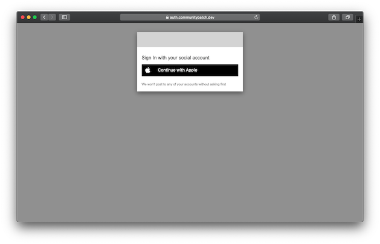
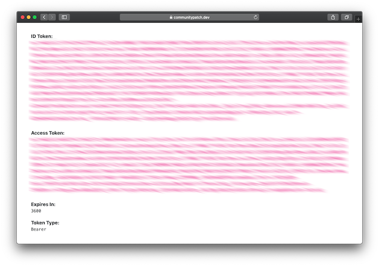

# CommunityPatch

CommunityPatch is a free, open-source, external patch source for Jamf Pro administrators to publish patch definitions they maintain for the broader Jamf community to subscribe to. Access CommunityPatch using an Apple ID, and then create and manage API tokens to interact with the service API.

### Quick Links

[Jamf Pro Setup](docs/JamfProSetup.md) | [Contributors API](apis/contributors/ContributorsAPI.md) | [Titles API](apis/titles/TitlesAPI.md)

## Jamf Pro Setup

Anyone can subscribed to a contributor's patch titles in Jamf Pro - they are publicly available feeds. All that is required is their `Contributor ID` or their `Contributor Alias`.

See the [Jamf Pro Setup documentation](docs/JamfProSetup.md) for more details.

### Browsing Contributors

_Coming soon..._

### Searching Titles

_Coming soon..._

## Contributor QuickStart Guide

If you wish to create and maintain a feed of patch title definitions on CommunityPatch, use the following instructions to sign in for the first time and begin using the APIs.

### Obtain an Access Token

Sign into CommunityPatch using an Apple ID by navigating to https://contributors.communitypatch.dev/login and authenticating (you may use any Apple ID you wish as a part of this process).

At this time, CommunityPatch does not have a web UI. There is a landing page at the root domain that will render the generated `Access Token` for you to copy. This token is not accessible from the service. _At this time the **ID Token** is unused._

### Explore With Postman

A Postman environment and collection have been provided with this repo to help you explore the API and perform some of the tasks described below without having to write any code. See the [instructions here](postman-collections/Postman.md) to learn more.

### Creating API Tokens

Your `Access Token` grants access to the Contributors API. This API allows you to manage your profile and `API Tokens`. API tokens can be created for use in scripting or other automation with CommunityPatch. These tokens can be configured with an expiration of up to 1 year, scoped to all or an individual title ID, 

See the [Contributors API documentation](apis/contributors/ContributorsAPI.md) for more details.

### Manage Titles

Once you have created an API token it can be used to create and manage patch title definitions on the Titles API. 

See the [Titles API documentation](apis/titles/TitlesAPI.md) for more details.
