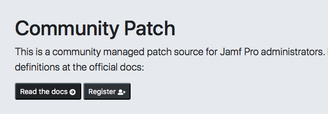
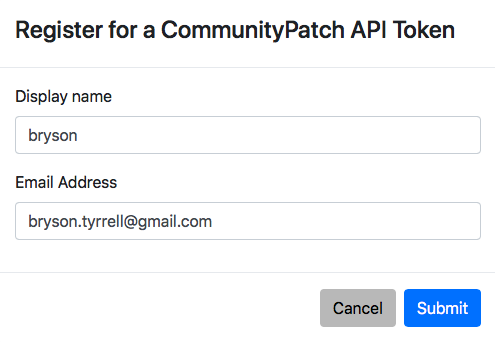
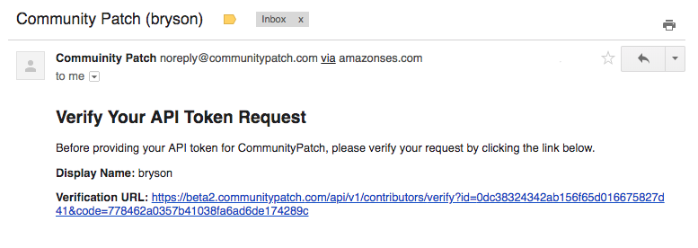
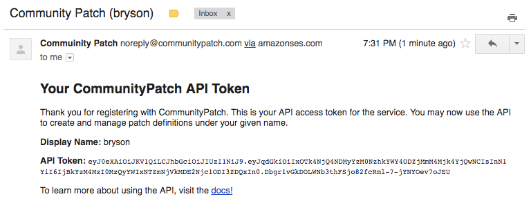

Registration
============

* To use CommunityPatch you must register for an API token. You may start the
  registration process from the home page by clicking the ``Register`` button.

* Enter your desired ``Display name`` and a valid ``Email address``.

* After clicking ``Submit``, CommunityPatch will send a verification email to
  the provided address.

* Click the link provided to be taken back to the CommunityPatch home page where
  a banner will display showing you have successfully verified your account.

.. image:: ../_static/register_04.png
    :scale: 75%

* Your API token will be emailed to you after seeing this message.

* This token can be used to manage patch definitions on CommunityPatch. Check
  out the API documentation to learn more on how to create, update, and delete
  patch definitions.

.. note::

    Your email address is saved using encryption. Your email address is not used
    for any purposes other than system generated notifications. This includes
    the registration process, resetting your API token, and error notifications
    when using repository syncing features.
