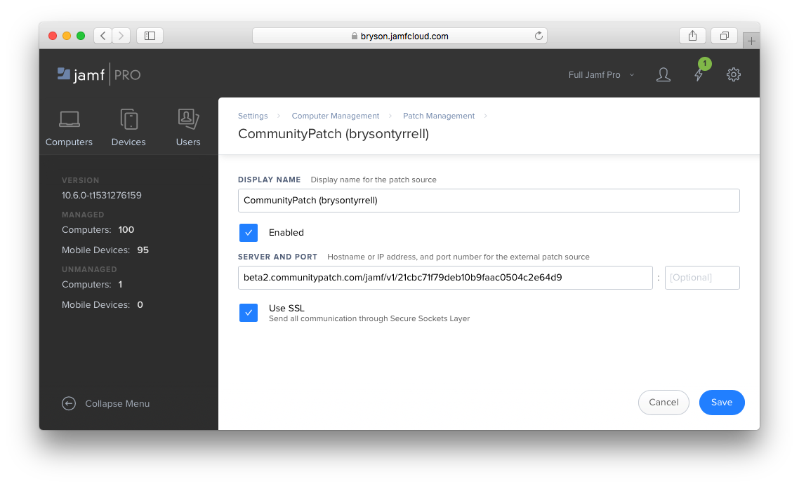
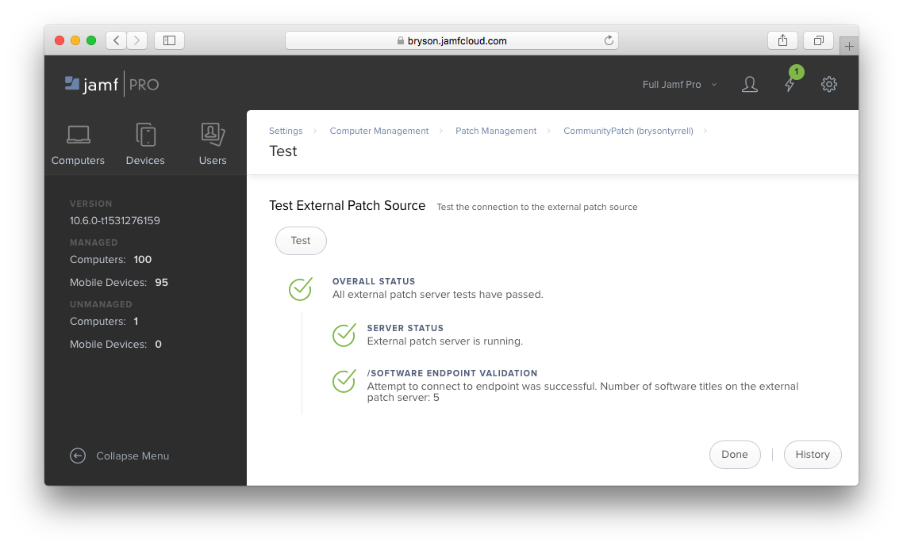

CommunityPatch.com
==================

CommunityPatch.com is a free, open-source patch source for Jamf Pro
administrators to publish patch definitions they maintain for the broader Jamf
community to subscribe to.

.. note::

    This documentation covers CommunityPatch ``Beta2``.

.. contents::
   :depth: 2
   :local:

Subscribing to Contributors
---------------------------

Each Contributor to CommunityPatch maintains their own set of software titles
that any Jamf administrator can subscribe to. If you wish to use the definitions
provided by a subscriber, you may do so using their unique ID.

.. note::

    Each Contributor on this service acts as an independent external patch
    source. Refer to `Jamf's documentation <https://www.jamf.com/jamf-nation/articles/497/jamf-pro-external-patch-source-endpoints>`_
    to learn more about external patch sources.

In Jamf Pro, navigate to **Settings > Computer Management > Patch Management**.
Click the **+ New** button to add a new external patch source.

Provide a ``Display Name`` and enter the address for the Contributor's source
into the ``Server and Port`` field as follows:

.. code-block:: text

    beta2.communitypatch.com/jamf/v1/{CONTRIBUTOR_ID}

After saving, use the **Test** option to verify Jamf Pro can successfully
connect to the

Managing Software Titles as a Contributor
-----------------------------------------

Become a Contributor and manage patch definitions for the community by
registering.

.. toctree::
    :maxdepth: 1
    :caption: Contributors

    contributors/register
    contributors/api

Use your API token to manage patch definitions for your and the community's use.

.. toctree::
    :maxdepth: 1
    :caption: Patch API Documentation

    api/create
    api/update
    api/delete

Join the discussion on the `MacAdmins Slack <https://macadmins.slack.com/messages/C9Z5YUN5N>`_.
