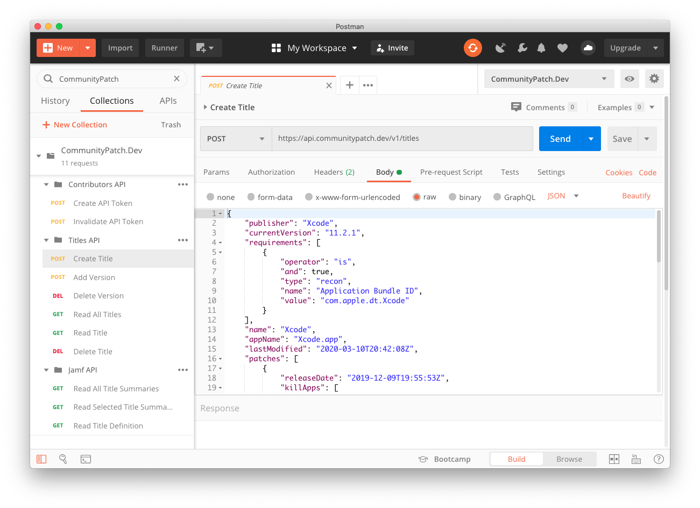

# Postman

These JSON files can be imported into Postman to explore the CommunityPatch APIs without having to use any code.

## Environment

Import [CommunityPatch.Dev.postman_environment.json](CommunityPatch.Dev.postman_environment.json) to setup the environment variables for the collection.

- **Access Token:** You will need to manually paste your generated access token from CommunityPatch into the _**Current Value**_ field. The access token is used for creating and invalidating API tokens with the Contributors API.
- **Contributor ID:** Your unique identifier.
- **API Token:** When you use the "Create API Token" request it will populate this environment variable for you and be referenced for all other Titles API requests.
- **API Token ID:** This will also be automatically populated for you. If you wish to invalidate the API token that was created using Postman it will reference this environment variable for the "Invalidate API Token" request.

## Collection

Import [CommunityPatch.Dev.postman_collection.json](CommunityPatch.Dev.postman_collection.json) to add the CommunityPatch.Dev API collection to Postman. Every type of requests for each API can be selected by expanding the appropriate folder.

Certain requests will have parameters in the URLs you will need to provide. You will see their markers with semi-colons: `:title_id` or `:contributor_id`. Click on the **Params** tab in the request to find **Path Variables** that are empty.

Some requests have been pre-populated with sample data. The "Create Title" and "Add Version" requests have starter JSON payloads for an Xcode patch definition.
